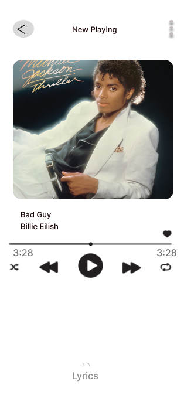

# PROYECTO FIGMA SPOTIFY
## Inicio De Spotify

## Elegir El Modo (Claro O Oscuro) Y Preciona El Boton Continuar

## Click En Iniciar Sesion

## Se Presiona Register Now

## Completar todo los campos (gmail,usuario y contraseña)

## Accediste con tu usuario y Contraseña

## Se visualiza el corrido de la música Bad Guys

## Se visualiza la cancion Bad Guys con letra

## Se puede eleguir otro tipo de jenero 

## Se muestra el genero de tintaya turpo

